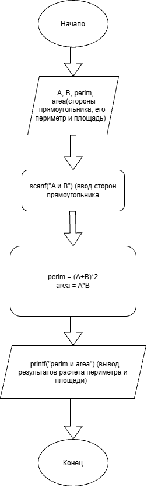

# Домашнее задание к работе 3

## Уловие задачи
Написать и отладить программу, вычисления площади и периметра прямоугольника со сторонами A и В, указанными пользователем.

## Алгоритм
1. Начало
2. Инициализация переменных A и B
3. Ввод значений с клавиатуры
4. Расчет периметра и площади:
   - perim = (A + B) * 2
   - area = A * B
5. Вывод результатов

### Блок-схема

[https://app.diagrams.net/#Llab_3_schema.png#%7B"pageId"%3A"-HSlFcVOjgjtYchVQxjc"%7D]

## 2. Реализация программы

<!-- #define _CRT_SECURE_NO_WARNINGS
#include <stdio.h>
#include <locale.h>

main()
{
	setlocale(LC_CTYPE, "RUS");
	int A;
	int B;
	printf("Введите значения A и B: ");
	scanf("%d%d", &A, &B);
	int perim = (A + B) * 2;
	int area = A * B;
	printf("Площадь = %d\nПериметр = %d\n", area, perim);
}-->

## 3. Результаты работы программы

[Расчет:
Введите значения A и B: 3
3
Площадь = 9
Периметр = 12

## 4. Информация о разработчике

Азиханов Дамир, бТИИ-262
